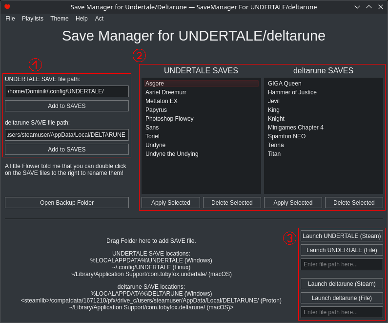
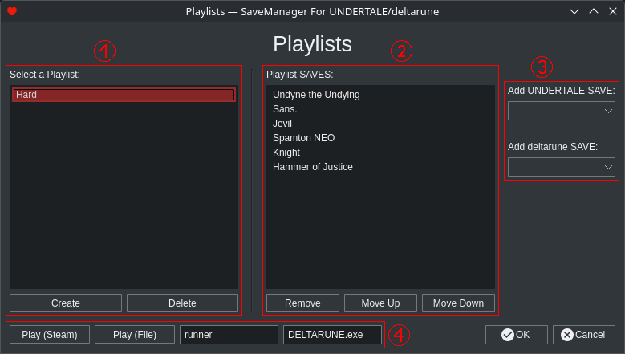

# Save Manager for Undertale and Deltarune

I always enjoy playing through various UNDERTALE and deltarune boss fights and minigames, like Sans, Jevil, Roaring Knight or Lightners Live.

Unfortunately, deltarune only supports 3 SAVE slots per chapter, UNDERTALE just one. This graphical tool helps with selecting save files,
backing them up and launching the game.

If there's a problem or you just have a question, either open an issue here on GitHub or contact me on Discord: `thecheese_knife`.

## Install

Prebuilt executables are available for Linux and Windows. If you're on any of these platforms, go to the [latest release](https://github.com/TheCheese42/ut-dr-save-manager/releases/latest) and under "Assets", download the right file for your platform.

Don't know which file to download?

- `udsm-linux-x86_64.bin` - This file is for Linux. Run it after enabling execute permissions.
- `udsm-win64-portable.exe` - This file is for Windows. You can not install it, just download and double click it in your file explorer.
- `udsm-win64.msi` - This file is for Windows. You can install it so the app is available on your Desktop and within your Start Menu (requires Administrator privileges).

> Note: On Windows you may get a Microsoft Defender security warning. There's nothing I can do about this, just try to ignore it. You may even have to exclude the file from the scan.

## Usage

### Main Window

(1) Before doing anything else, you need to tell the program where to find your SAVES! On most platforms, these values are determined automatically. If any of these are wrong or missing, please fill them in! You should also use the "Add to SAVES" function if you already have a SAVE file and don't want it to get lost.

(2) Here you can view and manage your precious SAVES. The ones displayed are already available at the start, no need to set anything up! Double click a SAVE to rename it, click "Apply Selected" so the game will load it on next launch.

(3) Here you can finally launch the game. Usually this is done via Steam, but if you prefer to launch the binary or `.exe` file, add the file path there. If you just want to launch via Steam you don't need to do anything!

### Playlists

Probably the most useful feature of Save Manager for Undertale and Deltarune are playlists. They allow you to create collections of SAVES to play them in order.

(1) Here you can create and delete your playlists. As always, double click to rename. Select a playlist to edit its contents.

(2) In this view, you can view, remove and reorder the SAVES of the selected playlist.

(3) Add your SAVES here. They will show up in the list to the left.

(4) Finally, run the playlists. The program will launch a game and wait until you close it before loading the next SAVE. For this, the game needs to know the process names of the games. If any of the two fields to the right are empty, please fill in the corresponding process names.

## Build

To build the program yourself, see [`BUILD.md`](./BUILD.md).

You generally do not need to do this, only if the provided builds do not run on your platform, or if you want to modify the app.
